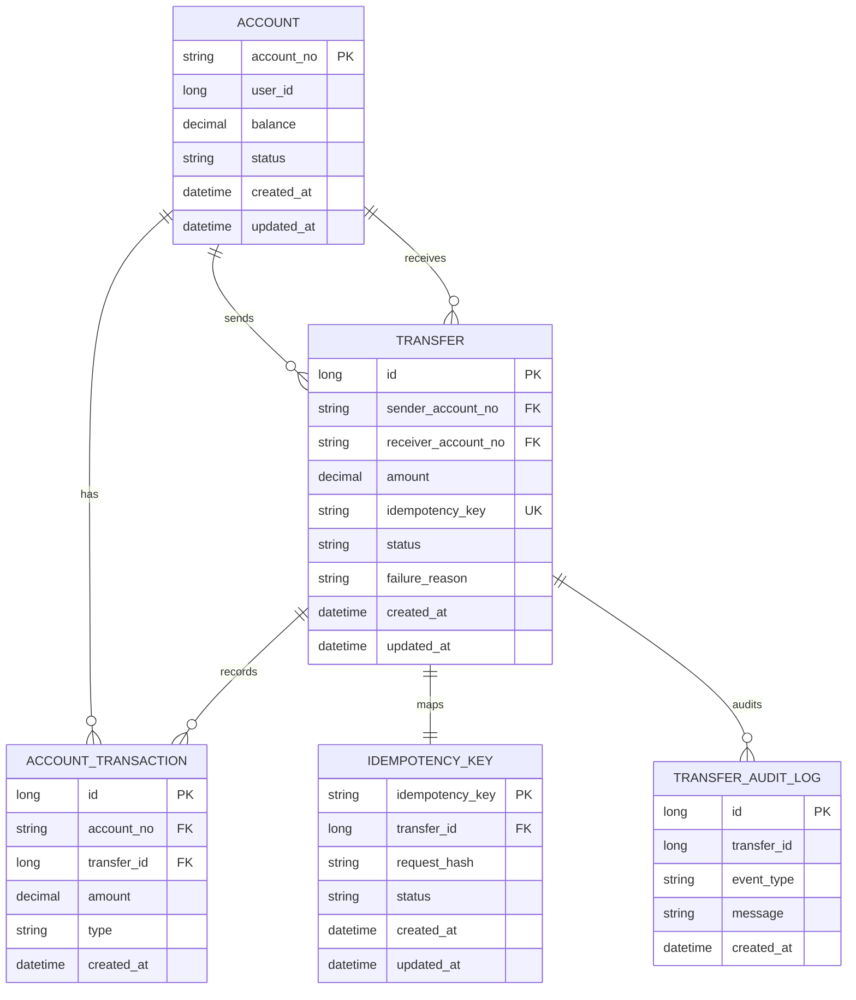

# Transfer Propagation Lab

계좌이체 도메인을 사용해 Spring Transaction Propagation을 학습하고 실제 코드에 적용해보는 프로젝트다.

단순히 `@Transactional` 예제를 나열하는 것이 아니라, “이체 성공/실패”, “멱등성”, “감사 로그”, “후처리”처럼 실제 서비스에서 만날 수 있는 경계를 기준으로 전파 속성을 배치한다.

## 학습 목표
- `REQUIRED`, `REQUIRES_NEW`, `MANDATORY`, `NOT_SUPPORTED`를 실제 이체 흐름에 맞게 배치한다.
- 이체 실행 트랜잭션이 실패했을 때 잔액 변경과 거래내역은 롤백한다.
- 실패 상태와 감사 로그는 별도 트랜잭션으로 반드시 남긴다.
- Spring AOP 기반 트랜잭션의 self-invocation 문제를 피하기 위해 전파 속성이 다른 로직을 서로 다른 bean으로 분리한다.
- `NESTED`는 핵심 플로우에 억지로 넣지 않고, 별도 실험 후보로만 남긴다.

## 도메인 기능
- 계좌 생성
- 계좌 이체
- 계좌 잔액 조회
- 계좌 거래 내역 조회

## 핵심 설계 방향
- 계좌 잔액 조회 성능을 위해 `account`에 현재 상태와 금액을 저장한다.
- 계좌 이체는 두 단계 트랜잭션으로 분리한다.
- `T1` 에서는 `idempotency_key` 를 저장하고, `transfer` 를 `IN_PROGRESS` 상태로 생성한다.
- `T2` 에서는 실제 계좌 이체를 수행하고, 성공 시 잔액 반영과 거래내역 생성, `transfer`/`idempotency_key` 상태를 함께 `SUCCEEDED` 로 갱신한다.
- `T2` 실패 시 잔액 변경은 모두 롤백하고, 별도 트랜잭션에서 `transfer`/`idempotency_key` 상태를 `FAILED` 로 갱신해 실패 이력을 남긴다.
- 동일 멱등키로 재요청이 들어오면 기존 `transfer` 를 기준으로 처리 결과를 반환하며, 같은 멱등키에 다른 요청 본문이 들어오면 예외 처리한다.
- 동일 계좌 이체에 대한 동시 요청은 송금/수취 계좌를 고정된 순서로 조회 후 행 잠금하여 직렬화하고, `T2` 안에서 잔액 검증을 수행해 잔액 정합성을 보장한다.
- 거래 상태는 `IN_PROGRESS`, `SUCCEEDED`, `FAILED` 로 관리하며 실패 시 실패 사유를 기록한다.
- `T1` 완료 후 장애가 발생해도 동일 멱등키 재시도로 기존 `transfer` 를 재사용할 수 있도록 설계한다.

## 1. ERD
account
- account_no (PK)
- user_id
- balance
- status (ACTIVE, INACTIVE)
- created_at
- updated_at

transfer
- id (PK)
- sender_account_no (FK -> account.account_no)
- receiver_account_no (FK -> account.account_no)
- amount
- idempotency_key
- status (IN_PROGRESS, SUCCEEDED, FAILED)
- failure_reason
- created_at
- updated_at

account_transaction
- id (PK)
- account_no (FK -> account.account_no)
- transfer_id (FK -> transfer.id)
- amount
- type (DEBIT, CREDIT)
- created_at

idempotency_key
- idempotency_key (PK)
- status (IN_PROGRESS, SUCCEEDED, FAILED)
- request_hash
- transfer_id (FK -> transfer.id)
- created_at
- updated_at

transfer_audit_log
- id (PK)
- transfer_id
- event_type (TRANSFER_SUCCEEDED, TRANSFER_FAILED)
- message
- created_at

### 제약조건
account
- PK
  - `pk_account(account_no)`
- CHECK
  - `chk_account_balance_non_negative(balance >= 0)`

transfer
- PK
  - `pk_transfer(id)`
- FK
  - `fk_transfer_sender_account(sender_account_no -> account.account_no)`
  - `fk_transfer_receiver_account(receiver_account_no -> account.account_no)`
- UNIQUE
  - `uk_transfer_idempotency_key(idempotency_key)`
- INDEX
  - `idx_transfer_sender_created_at(sender_account_no, created_at)`
  - `idx_transfer_receiver_created_at(receiver_account_no, created_at)`
- CHECK
  - `chk_transfer_amount_positive(amount > 0)`
  - `chk_transfer_not_same_account(sender_account_no <> receiver_account_no)`

account_transaction
- PK
  - `pk_account_transaction(id)`
- FK
  - `fk_account_transaction_account(account_no -> account.account_no)`
  - `fk_account_transaction_transfer(transfer_id -> transfer.id)`
- INDEX
  - `idx_account_transaction_account_created_at(account_no, created_at)`
  - `idx_account_transaction_transfer_id(transfer_id)`
- CHECK
  - `chk_account_transaction_amount_positive(amount > 0)`

idempotency_key
- PK
  - `pk_idempotency_key(idempotency_key)`
- FK
  - `fk_idempotency_key_transfer(transfer_id -> transfer.id)`
- INDEX
  - `idx_idempotency_key_transfer_id(transfer_id)`

transfer_audit_log
- PK
  - `pk_transfer_audit_log(id)`
- INDEX
  - `idx_transfer_audit_log_transfer_id(transfer_id)`



## 2. 패키지/클래스 구조
```text
com.example.transferservice
├── account
│   ├── domain
│   │   ├── Account
│   │   └── AccountStatus
│   ├── repository
│   │   └── AccountRepository
│   └── service
│       └── AccountBalanceService
├── idempotency
│   ├── domain
│   │   ├── IdempotencyKey
│   │   └── IdempotencyKeyStatus
│   └── repository
│       └── IdempotencyKeyRepository
├── transfer
│   ├── domain
│   │   ├── Transfer
│   │   ├── AccountTransaction
│   │   └── TransferAuditLog
│   ├── dto
│   │   ├── TransferCommand
│   │   ├── PreparedTransfer
│   │   └── TransferResponse
│   ├── repository
│   └── service
│       ├── TransferFacadeService
│       ├── TransferPreparationService
│       ├── TransferExecutionService
│       ├── TransferFailureService
│       ├── TransferAuditService
│       ├── AccountTransactionHistoryService
│       └── TransferNotificationService
└── common
    └── exception
```

## 3. Transaction Propagation 설계
이 프로젝트는 단순 예제용 전파 속성 샘플이 아니라 실제 계좌이체 흐름에 자연스럽게 전파 속성을 배치한다.

| 클래스 | 전파 속성 | 역할 |
| --- | --- | --- |
| `TransferFacadeService` | 없음 | 전체 흐름을 조립한다. self-invocation을 피하기 위해 전파 속성이 다른 로직을 직접 내부 메서드로 호출하지 않는다. |
| `TransferPreparationService.prepare` | `REQUIRED` | T1. 멱등키와 `transfer(IN_PROGRESS)`를 먼저 생성한다. |
| `TransferExecutionService.execute` | `REQUIRED` | T2. 계좌 잠금, 출금, 입금, 거래내역 저장, 성공 상태 변경을 하나의 트랜잭션으로 묶는다. |
| `AccountBalanceService.debit/credit` | `MANDATORY` | 반드시 T2 이체 트랜잭션 안에서만 잔액을 변경한다. |
| `AccountTransactionHistoryService.recordDebit/recordCredit` | `MANDATORY` | 반드시 T2 이체 트랜잭션 안에서만 거래내역을 저장한다. |
| `TransferFailureService.recordFailure` | `REQUIRES_NEW` | T2 실패로 잔액/거래내역이 롤백되어도 `transfer`와 `idempotency_key`의 `FAILED` 상태는 별도 트랜잭션으로 남긴다. |
| `TransferAuditService.recordSuccess/recordFailure` | `REQUIRES_NEW` | 감사 로그는 이체 트랜잭션과 분리해서 별도로 남긴다. |
| `TransferNotificationService.notifyTransferResult` | `NOT_SUPPORTED` | 알림 같은 후처리는 핵심 트랜잭션과 분리한다. |

`NESTED`는 핵심 이체 플로우에 억지로 넣지 않는다. 실험이 필요하다면 예를 들어 “거래내역 부가 메타데이터 저장 실패만 savepoint로 롤백하는 기능”처럼 핵심 잔액 정합성과 무관한 별도 실험 API에서만 사용한다.

## 4. 이체 흐름
1. `TransferFacadeService`가 요청을 받는다.
2. `TransferPreparationService.prepare`가 동일 멱등키를 조회한다.
3. 기존 멱등키가 있고 payload hash가 다르면 예외 처리한다.
4. 기존 멱등키가 있고 payload hash가 같으면 기존 `transfer` 상태를 기준으로 응답을 재사용한다.
5. 신규 요청이면 `idempotency_key`와 `transfer(IN_PROGRESS)`를 생성한다.
6. `TransferExecutionService.execute`가 송금/수취 계좌를 account_no 기준 고정 순서로 잠근다.
7. `AccountBalanceService`가 출금/입금을 수행한다.
8. `AccountTransactionHistoryService`가 출금/입금 거래내역을 저장한다.
9. 성공하면 `transfer`와 `idempotency_key`를 `SUCCEEDED`로 변경한다.
10. T2 도중 예외가 발생하면 잔액 변경과 거래내역은 롤백된다.
11. T2 실패 후 `TransferFailureService.recordFailure`가 별도 트랜잭션으로 `FAILED` 상태를 저장한다.
12. `TransferAuditService`가 성공/실패 감사 로그를 별도 트랜잭션으로 저장한다.

## 5. 실패 흐름 예외 처리
- 잔액 부족, 계좌 없음, 거래내역 저장 실패 등 T2 내부 예외는 `TransferExecutionService.execute`의 `REQUIRED` 트랜잭션을 롤백한다.
- `TransferFacadeService`는 T2 예외를 잡고 `TransferFailureService.recordFailure`를 호출한 뒤 원래 예외를 다시 던진다.
- 실패 기록은 `REQUIRES_NEW`이므로 T2 롤백과 무관하게 커밋된다.
- 같은 클래스 내부에서 `this.recordFailure()`처럼 호출하지 않고 별도 Spring bean을 주입받아 호출해 self-invocation 문제를 피한다.

## 6. 테스트 시나리오
- 정상 이체: 송금 계좌 잔액 감소, 수취 계좌 잔액 증가, 거래내역 2건, `transfer/idempotency_key=SUCCEEDED`, 감사 로그 저장을 검증한다.
- 잔액 부족: 잔액과 거래내역은 롤백되고, `transfer/idempotency_key=FAILED`, 실패 감사 로그가 남는지 검증한다.
- 동일 멱등키 재요청: 같은 payload면 기존 `transfer` 상태를 재사용하고, 다른 payload면 `IdempotencyConflictException`이 발생하는지 검증한다.
- T1 성공 후 T2 실패: `transfer(IN_PROGRESS)` 생성 후 T2에서 예외가 나도 `REQUIRES_NEW` 실패 기록이 남는지 검증한다.
- self-invocation 방지: `MANDATORY` 메서드를 트랜잭션 없이 직접 호출하면 실패하고, `TransferExecutionService`를 통해 호출하면 성공하는지 검증한다.
