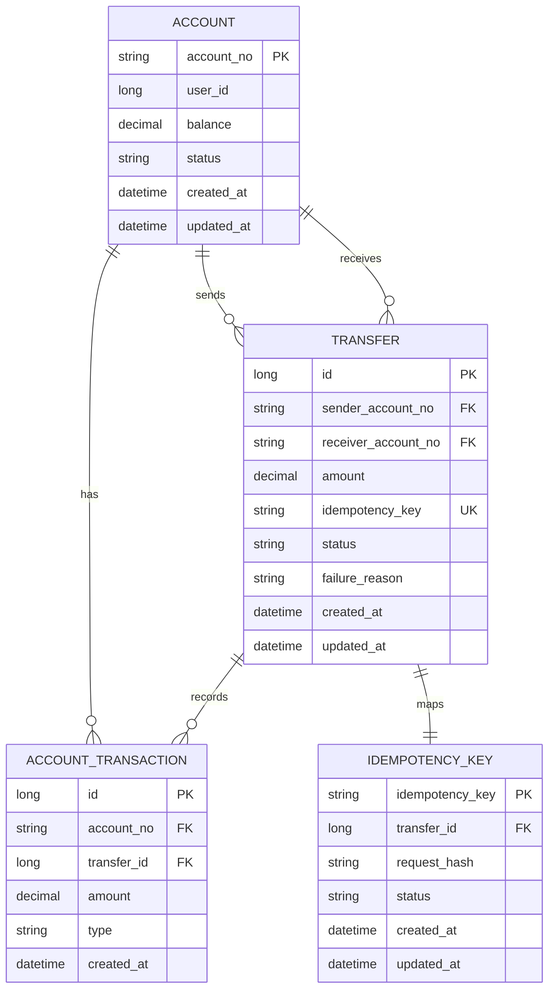

# Transfer Service - 계좌이체 서비스

## 제공 기능
- 계좌 생성
- 계좌 이체
- 계좌 잔액 조회
- 계좌 거래 내역 조회

## 핵심 설계
- 계좌 잔액 조회 성능을 위해 `account`에 현재 상태와 금액을 저장한다.
- 계좌 이체는 두 단계 트랜잭션으로 분리한다.
- `T1` 에서는 `idempotency_key` 를 저장하고, `transfer` 를 `IN_PROGRESS` 상태로 생성한다.
- `T2` 에서는 실제 계좌 이체를 수행하고, 성공 시 잔액 반영과 거래내역 생성, `transfer`/`idempotency_key` 상태를 함께 `SUCCEEDED` 로 갱신한다.
- `T2` 실패 시 잔액 변경은 모두 롤백하고, 별도 트랜잭션에서 `transfer`/`idempotency_key` 상태를 `FAILED` 로 갱신해 실패 이력을 남긴다.
- 동일 멱등키로 재요청이 들어오면 기존 `transfer` 를 기준으로 처리 결과를 반환하며, 같은 멱등키에 다른 요청 본문이 들어오면 예외 처리한다.
- 동일 계좌 이체에 대한 동시 요청은 송금/수취 계좌를 고정된 순서로 조회 후 행 잠금하여 직렬화하고, `T2` 안에서 잔액 검증을 수행해 잔액 정합성을 보장한다.
- 거래 상태는 `IN_PROGRESS`, `SUCCEEDED`, `FAILED` 로 관리하며 실패 시 실패 사유를 기록한다.
- `T1` 완료 후 장애가 발생해도 동일 멱등키 재시도로 기존 `transfer` 를 재사용할 수 있도록 설계한다.

## 1. ERD
account
- account_no (PK)
- user_id
- balance
- status (ACTIVE, INACTIVE)
- created_at
- updated_at

transfer
- id (PK)
- sender_account_no (FK -> account.account_no)
- receiver_account_no (FK -> account.account_no)
- amount
- idempotency_key
- status (IN_PROGRESS, SUCCEEDED, FAILED)
- failure_reason
- created_at
- updated_at

account_transaction
- id (PK)
- account_no (FK -> account.account_no)
- transfer_id (FK -> transfer.id)
- amount
- type (DEBIT, CREDIT)
- created_at

idempotency_key
- idempotency_key (PK)
- status (IN_PROGRESS, SUCCEEDED, FAILED)
- request_hash
- transfer_id (FK -> transfer.id)
- created_at
- updated_at

### 제약조건
account
- PK
  - `pk_account(account_no)`
- CHECK
  - `chk_account_balance_non_negative(balance >= 0)`

transfer
- PK
  - `pk_transfer(id)`
- FK
  - `fk_transfer_sender_account(sender_account_no -> account.account_no)`
  - `fk_transfer_receiver_account(receiver_account_no -> account.account_no)`
- UNIQUE
  - `uk_transfer_idempotency_key(idempotency_key)`
- INDEX
  - `idx_transfer_sender_created_at(sender_account_no, created_at)`
  - `idx_transfer_receiver_created_at(receiver_account_no, created_at)`
- CHECK
  - `chk_transfer_amount_positive(amount > 0)`
  - `chk_transfer_not_same_account(sender_account_no <> receiver_account_no)`

account_transaction
- PK
  - `pk_account_transaction(id)`
- FK
  - `fk_account_transaction_account(account_no -> account.account_no)`
  - `fk_account_transaction_transfer(transfer_id -> transfer.id)`
- INDEX
  - `idx_account_transaction_account_created_at(account_no, created_at)`
  - `idx_account_transaction_transfer_id(transfer_id)`
- CHECK
  - `chk_account_transaction_amount_positive(amount > 0)`

idempotency_key
- PK
  - `pk_idempotency_key(idempotency_key)`
- FK
  - `fk_idempotency_key_transfer(transfer_id -> transfer.id)`
- INDEX
  - `idx_idempotency_key_transfer_id(transfer_id)`

